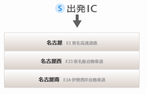
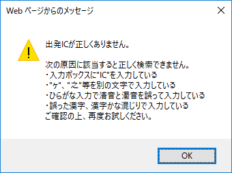
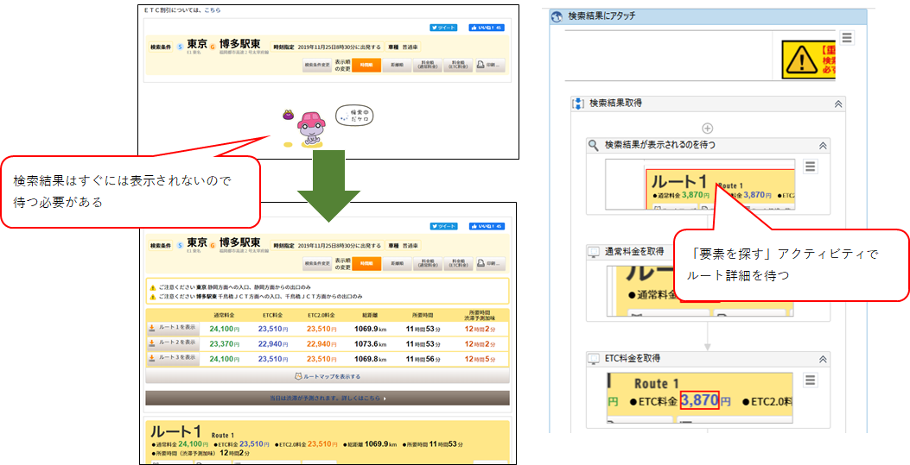

【UiPath】サンプル：高速道路料金を調べる作業を自動化

# 概要

出張などの交通費チェック作業で、使用者が申請した高速道路料金が正しいかチェックする。
インプットは、Excelに記載された利用ICと料金の一覧表。ここに記載された出発IC～到着ICの料金を順次検索する。

料金検索に使用するのは、NEXCO中日本の[ドライブコンパス](https://dc.c-nexco.co.jp/dc/DriveCompass.html)というWebサイト。

# IC名を入力する
まず、Excelで指定された出発ICと到着ICを入力して検索ボタンを押す。
IC名が正確ならそのまま検索結果が表示されるが、あいまいで特定できない場合、候補リストが表示される。

そして、IC名に間違いがある場合は、エラーのダイアログが表示される。

あいまいな場合もエラーな場合も、IC名を確定できなかったとして検索をスキップするようにしたい。
つまり、候補リストかダイアログのどちらかが表示されたのを判定すればよい。
この判断分岐をUiPathで実装する場合、`要素の有無を検出`アクティビティを使うが、このアクティビティは「要素がない」と判定するまでにタイムアウトに設定した時間を消費する。
つまり2つの`要素の有無を検出`を並べると、「どちらもない」と判定するまでに2つ分のタイムアウトが経過しないと処理が進まない。
そのため、2つの`要素の有無を検出`を並列にすることによって、判定時間の省略を図っている。

# 検索結果を取得する

IC名を入力して検索ボタンを押すと、ルートおよび料金などの検索結果が表示される。
ドライブコンパスのページでは検索後すぐには結果が表示されないため、`要素を探す`アクティビティを使い検索結果が表示されるのを待ってから料金を取得する。

