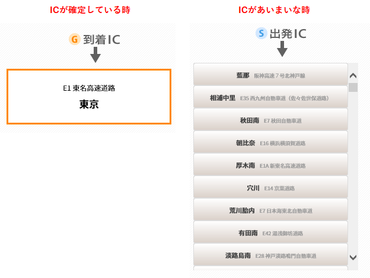

【UiPath】サンプル：高速道路料金を調べる作業を自動化

# 概要

出張などの交通費チェック作業で、使用者が申請した高速道路料金が正しいかチェックする。
インプットは、Excelに記載された利用ICと料金の一覧表。ここに記載された出発IC～到着ICの料金を順次検索する。

料金検索に使用するのは、NEXCO中日本の[ドライブコンパス](https://dc.c-nexco.co.jp/dc/DriveCompass.html)というWebサイト。

# IC名を入力する
まず、Excelで指定された出発ICと到着ICを入力して検索ボタンを押す。
IC名が正確なら、そのまま検索結果が表示されるが、あいまいで特定できない場合、候補リストが表示される。

そして、IC名に間違いがある場合は、エラーのダイアログが表示される。

この判断分岐をUiPathで実装する場合、「要素の有無を検出」アクティビティを使うが、2つのアクティビティを並列にすることによって、判定時間の省略を図っている。

## 候補リスト
候補リストの出方にも複数パターンがある。
IC名が確定している場合とあいまいな場合で、以下のように表示される。

## 候補が0件の場合
IC名が正しくないとして、検索を実施しない。
実際、この状態で検索ボタンを押しても、Webページからエラーが通知される。

## 候補が1件の場合
表示された候補をそのまま利用する。
入力したIC名が不完全な場合を考慮して、Excelファイルに選択したIC名を書き込むようにしている。

## 候補が複数件の場合
複数の候補が見つかる場合、完全一致するIC名があればそれを選択するが、無い場合はICが見つからなかったとして料金検索を行わない。

 ## じっそう

 

 
